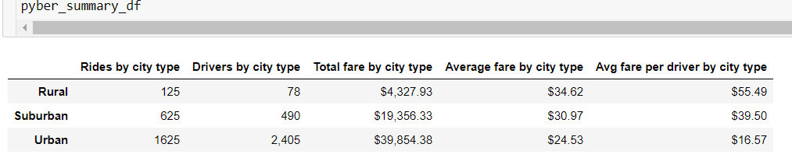

# PyBer_Analysis

## Overview

As part of PyBer, one of the projects that we have been working on is to tell a visual story from the data available. The objective is to make it easier for the end-user by presenting complex finding in an engaging way. This can help project planning, and help drive business decisions.

## Results

As we can see from the summary dataframe below:
* Drivers exceed rides in urban cities
* Average fare is highest is rural cities($34) and almost $10 lower in urban cities
* Average fare per driver is highest in rural cities($55) and is drastically lower in urban cities($16)

As we can see from the graph below:
* Total fare is highest in urban cities, most likely driven by the ride volume
* There is a consistent spike in total fare across all cities on february 18th

## Summary

There are certain steps that can be taken to address the disparities among city types:
* The rides:driver ratio is skewed unfavourably. We should either onboard lower number of drivers in certain urban cities
* Alternatively, we should look to boost rides in certain cities by marketing campaings etc.
* Find ways to increase average fare in certain urban cities to balance the differrence in average fares
